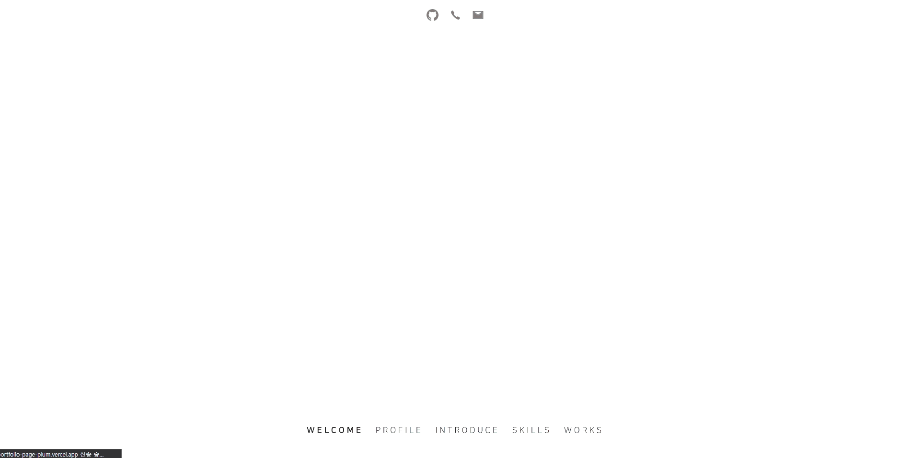

# 📋 Portfolio-Page

포트폴리오 페이지 w/React & TypeScript  
https://uncyclocity.tech

## 📃 개요

- React를 통해 페이지로 제작한 개인 포트폴리오입니다.
- 컴포넌트 구조는 **아토믹 디자인 패턴** 지향적으로 설계하였습니다.
- **TypeScript**를 통해 제작하였습니다.

## 💻 사용 기술

   

## 📜 간략한 사용 설명서

- 슬라이드 쇼 형태로 페이지를 구성하였으며, Footer의 각 버튼을 누르거나 마우스 휠을 돌려 페이지를 전환할 수 있습니다.
- Header의 각 버튼을 눌러 저의 개인 GitHub로 이동하거나 연락처를 클립보드에 복사할 수 있습니다.
