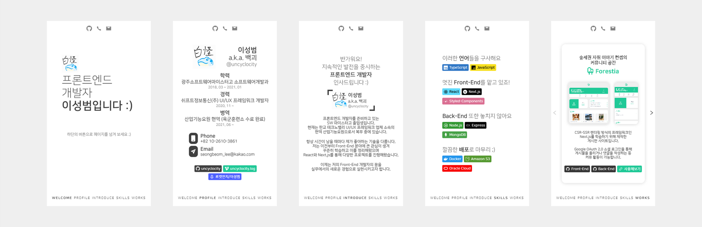

## 📰 About-Uncyclocity

프론트엔드 개발자 이성범을 보다 인상깊게 표현하기 위한 포트폴리오 페이지입니다. 
<a href="https://uncyclocity.tech">이곳</a>에서 직접 사용해보실 수 있습니다.

## 📃 개요

- React를 통해 제작한 개인 포트폴리오 페이지입니다.
- 컴포넌트 구조는 **아토믹 디자인 패턴** 지향적으로 설계하였습니다.
- JS 기반의 정적 타입 명시 언어인 **TypeScript**를 최초로 도입하였습니다.

## 💻 사용 기술

   

## 📜 간략한 사용 설명서

- 슬라이드 쇼 형태로 페이지를 구성하였으며, Footer의 각 버튼을 누르거나 마우스 휠을 돌려 페이지를 전환할 수 있습니다.
- Header의 각 버튼을 눌러 저의 개인 GitHub로 이동하거나 연락처를 클립보드에 복사할 수 있습니다.

## 🕓 향후 계획

- 경력 사항에 대한 자세한 정보를 제공하는 페이지 제작
- 프로젝트에 대한 보다 자세한 설명 페이지 제작
- 변경 사항이 발생할 때 마다 갱신
